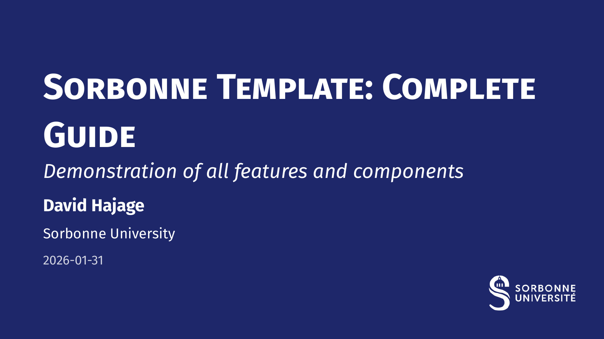
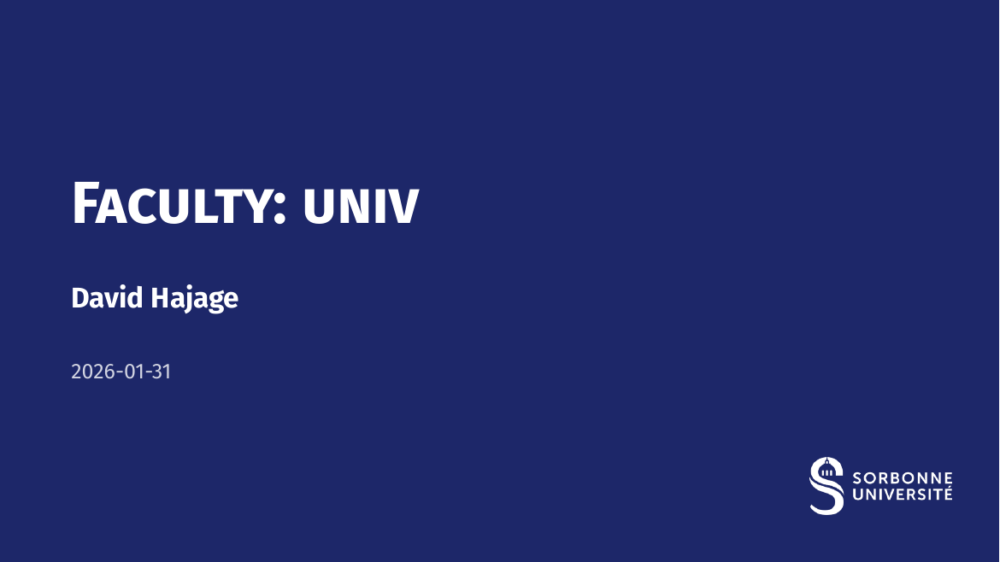
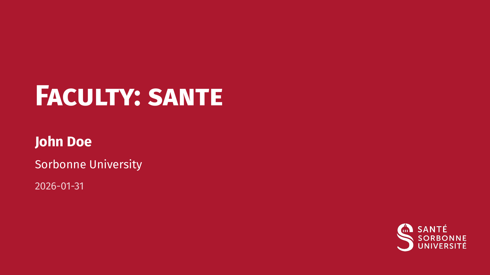
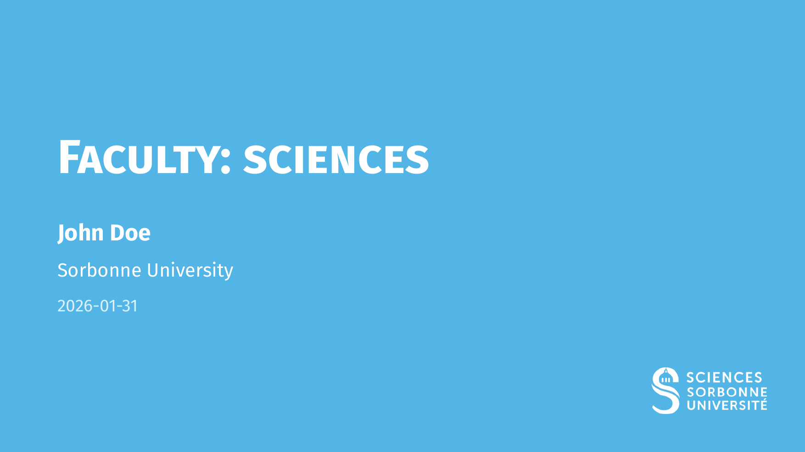
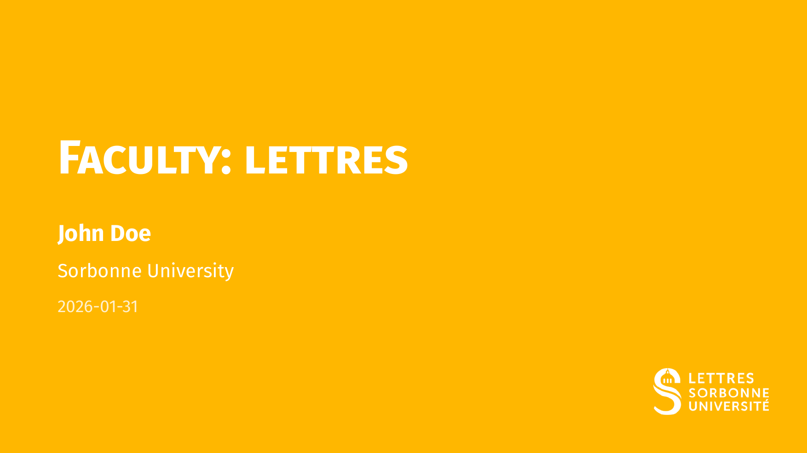
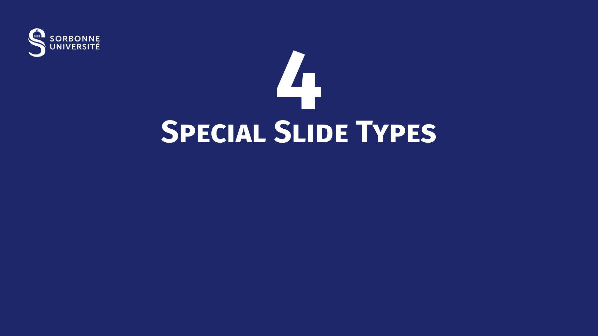

# Sorbonne Presentation Theme

A professional, structured, and modern presentation theme for **Sorbonne University**, built on top of the [presentate](https://typst.app/universe/package/presentate) and [navigator](https://github.com/eusebe/typst-navigator) packages.

---

## Overview

The **Sorbonne Presentation Theme** is designed to provide academic and institutional slide decks that respect the visual identity of Sorbonne University while offering powerful dynamic features.



- **Faculty Presets**: Built-in colors and logos for Health, Science, Humanities, and University-wide presentations.
- **Smart Navigation**: Automatic breadcrumbs, transition slides with roadmaps, and flexible hierarchy mapping.
- **Dynamic Content**: Seamless integration of `pause`, `uncover`, and `only` for step-by-step reveals.
- **Scientific Ready**: Specialized slides for equations (with "signature" citations), figures, and algorithms.

## Quick Start

```typ
#import "@preview/sorbonne-presentation:0.1.0": *

#show: template.with(
  title: [Scientific Discovery],
  subtitle: [New Insights in Physics],
  author: [John Doe],
  faculty: "sciences",
  show-outline: true,
)

= Introduction
#slide[
  - High performance
  - Intuitive syntax
  #show: pause
  - *Dynamic* animations
]

#ending-slide()
```

## Features

### 🎨 Faculty Presets
Switch visual identities instantly using the `faculty` parameter:

| Univ | Sante | Sciences | Lettres |
|:---:|:---:|:---:|:---:|
|  |  |  |  |

- `univ`: Sorbonne Blue (University-wide)
- `sante`: Sorbonne Red (Faculty of Health)
- `sciences`: Sorbonne Light Blue (Faculty of Science & Engineering)
- `lettres`: Sorbonne Yellow/Ocre (Faculty of Humanities)

### 🗺️ Hierarchy Mapping
Control your document structure with the `mapping` dictionary. It links heading levels to logical roles:
- `(section: 1)`: Standard setup.
- `(part: 1, section: 2, subsection: 3)`: Complex hierarchy.
Transition slides and breadcrumbs automatically adapt to these roles.

### ✨ Special Slide Types
- **Focus Slide**: For impactful messages on a solid background.
- **Figure Slide**: Centered figures with automatic captions.
- **Equation Slide**: Large equations with a "signature" style citation and variable definitions.



- **Acknowledgement Slide**: To thank contributors and institutions.
- **Ending Slide**: A professional closing slide with contact info.

## Configuration

| Parameter | Type | Default | Description |
|-----------|------|---------|-------------|
| `title` | content | `none` | Main presentation title |
| `author` | content | `none` | Presenter's name |
| `faculty` | string | `"sante"` | Preset: `"sante"`, `"sciences"`, `"lettres"`, `"univ"` |
| `mapping` | dict | `(section: 1, subsection: 2)` | Logical role mapping for headings |
| `show-outline` | bool | `false` | Toggle summary slide |
| `outline-columns` | int | `1` | Number of columns for the summary |
| `auto-title` | bool | `true` | Use current section as slide title if none provided |
| `numbering-format` | string | `"1.1"` | Format for sections and subsections |
| `aspect-ratio` | string | `"16-9"` | Slide aspect ratio (`"16-9"` or `"4-3"`) |

## Component Reference

### Text Styles
- `#alert[Important]`: Accent-colored bold text.
- `#muted[Secondary]`: Discreet gray text.
- `#subtle[Tertiary]`: Very light gray text.

### Layout
- `#two-col(left, right, columns: (1fr, 1fr))`: Equal or custom width columns.
- `#three-col(left, center, right)`: Three balanced columns.

### Boxes
- `#highlight-box(title: "Key", body)`: Blue university-styled box.
- `#alert-box(title: "Warning", body)`: Red cautionary box.
- `#example-box(title: "Example", body)`: Green academic example box.
- `#algorithm-box(title: "Algorithm", body)`: Monospace box for code logic.
- `#themed-block(title: "Adaptive", body)`: Box matching the faculty color.

## Credits

- **Underlying Packages**: Built with [presentate](https://typst.app/universe/package/presentate) and [navigator](https://github.com/eusebe/typst-navigator).
- **Inspiration**: Some layout features and component designs were inspired by the [calmly-touying](https://typst.app/universe/package/calmly-touying) theme. A special thanks to its author for the high-quality design inspiration.

## License

MIT License. See [LICENSE](LICENSE) for details.