# Unified Academic Presentation Themes (Sorbonne & IPLESP)

A non-official structured presentation toolkit for Typst, providing two institutional themes: **Sorbonne University** and **IPLESP**. Built on top of the [presentate](https://typst.app/universe/package/presentate) and [navigator](https://typst.app/universe/package/navigator) packages.

---

## Overview

This package offers highly customizable, academic-ready slide decks with a shared core engine. Whether you are presenting for a Sorbonne Faculty or the IPLESP laboratory, you benefit from the same powerful features:

- **Institutional Identities**: Pre-configured colors and logos for both institutions.
- **Dark Mode**: Full support for dark-themed slides via the `dark-mode` parameter.
- **Smart Navigation**: Automatic breadcrumbs, transition slides with roadmaps, and flexible hierarchy mapping.
- **Dynamic Content**: Seamless integration of `pause`, `uncover`, and `only` for step-by-step reveals.
- **Scientific Ready**: Specialized slides for equations, figures, and algorithms.

---

## 🎨 Sorbonne Theme Presets

Switch between Sorbonne University faculties using the `faculty` and `dark-mode` parameters.

| Mode | Univ | Sante | Sciences | Lettres |
|:---:|:---:|:---:|:---:|:---:|
| **Light** |  | 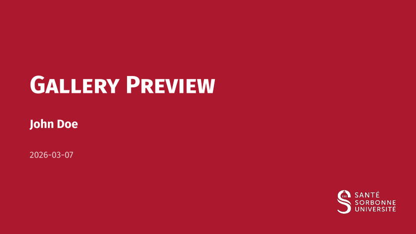 | 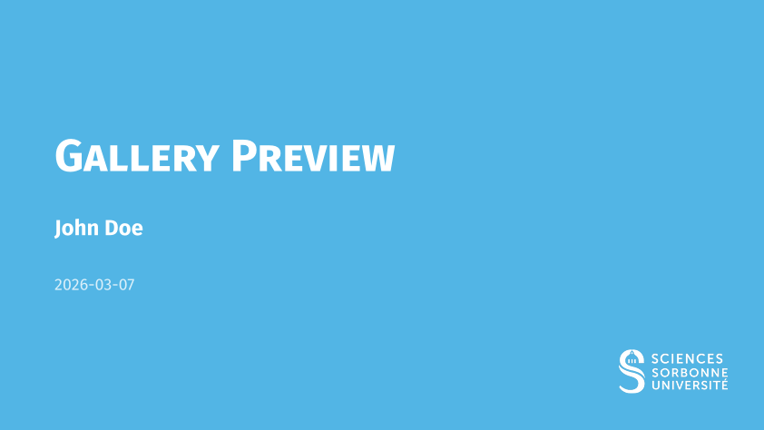 |  |
| **Dark** |  | 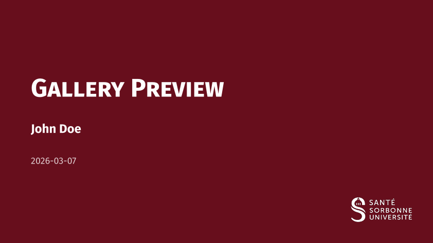 |  |  |

- `univ`: Sorbonne Blue (University-wide)
- `sante`: Sorbonne Red (Faculty of Health)
- `sciences`: Sorbonne Light Blue (Faculty of Science & Engineering)
- `lettres`: Sorbonne Yellow/Ocre (Faculty of Humanities)

---

## 🎨 IPLESP Theme Presets

The IPLESP theme provides multiple color variants via the `theme` parameter. It features a modern header with a logo bar (Inserm, IPLESP, Sorbonne Health).

| Mode | Blue | Red | Green | Purple |
|:---:|:---:|:---:|:---:|:---:|
| **Light** | 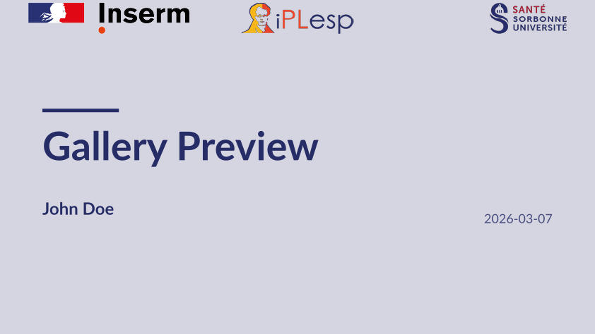 | 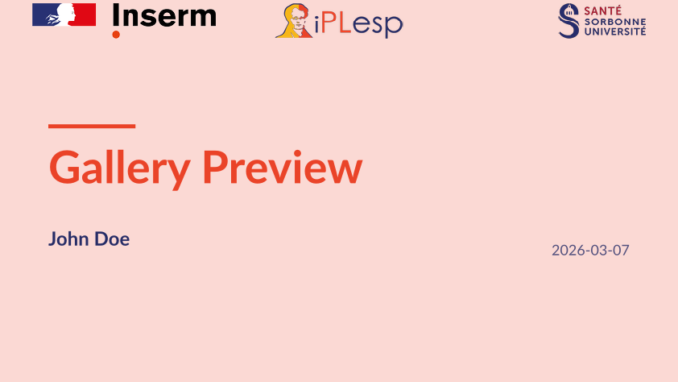 | 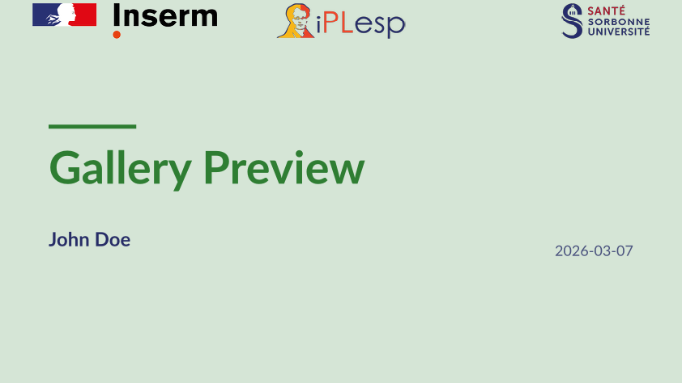 | 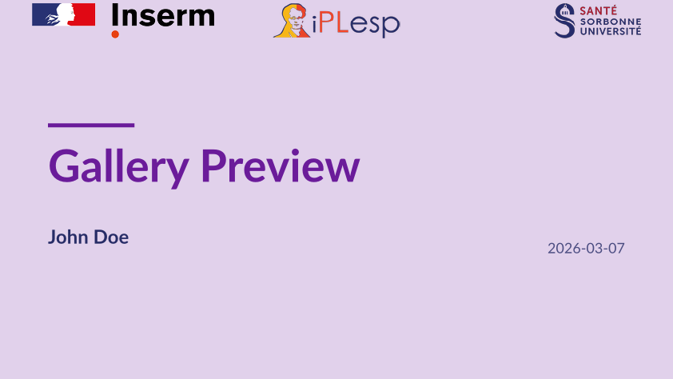 |
| **Dark** | 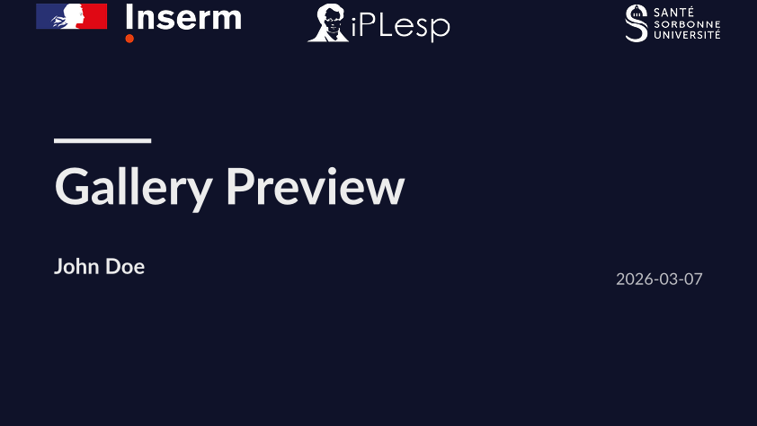 | 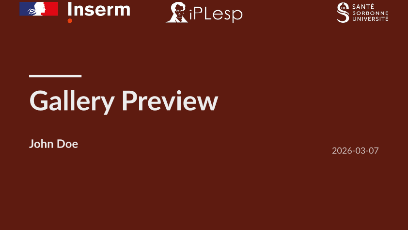 | 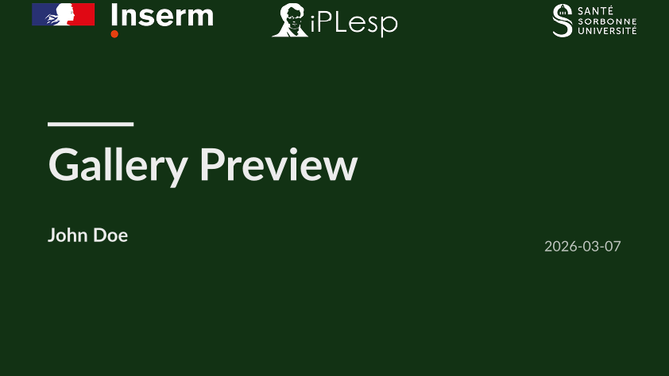 | 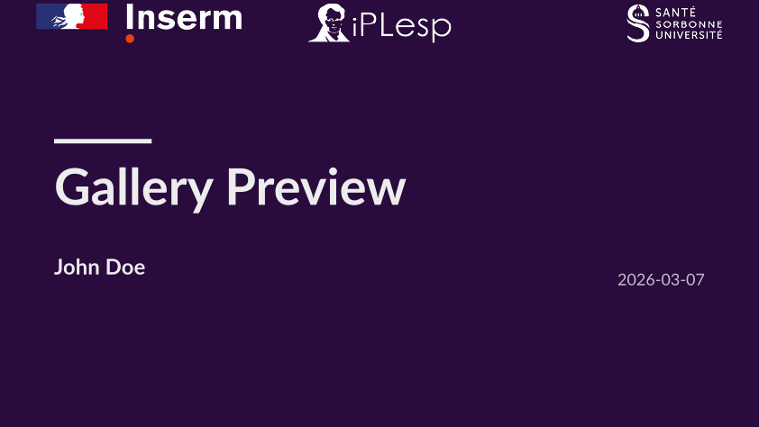 |

*Other available colors: `yellow`, `teal`, `orange`, `slate`.*

---

## Quick Start

### For Sorbonne University
```typ
#import "@preview/sorbonne-iplesp-presentation:0.1.0": sorbonne-template, slide

#show: sorbonne-template.with(
  title: [Academic Discovery],
  author: [John Doe],
  faculty: "sciences",
)

= Introduction
#slide[
  - High performance Typst engine
  #show: pause
  - Custom Sorbonne styling
]
```

### For IPLESP
```typ
#import "@preview/sorbonne-iplesp-presentation:0.1.0": iplesp-template, slide

#show: iplesp-template.with(
  title: [Epidemiological Study],
  author: [Jane Smith],
  theme: "teal",
)

= Methodology
#slide[
  Research conducted at Laboratory...
]
```

---

## Logo Customization

You can easily replace the institutional logos with your own by using the following parameters.

### `logo-transition` (Monochrome/White version)
Used on **solid theme-colored backgrounds**.
- **Sorbonne**: Title slide (bottom right), Transitions (top left), Focus & Ending slides.
- **IPLESP**: Title & Special slides (top left logo bar).

### `logo-slide` (Color version)
Used on **standard slides** (white background).
- **Sorbonne**: Header next to title.
- **IPLESP**: Top-left corner of the logo bar.

---

## Configuration Reference

### Common Parameters

| Parameter | Type | Default | Description |
|-----------|------|---------|-------------|
| `title` | content | `none` | Main presentation title |
| `short-title` | content | `none` | Short version for footer |
| `subtitle` | content | `none` | Optional subtitle |
| `author` | content | `none` | Presenter's name |
| `short-author` | content | `none` | Short version for footer |
| `affiliation` | content | `none` | Department or Laboratory |
| `date` | content | `datetime...` | Custom date display |
| `dark-mode` | bool | `false` | Enable dark theme for content slides |
| `aspect-ratio` | string | `"16-9"` | `"16-9"` or `"4-3"` |
| `text-size` | length | `20pt` | Base text size |
| `show-outline` | bool | `false` | Toggle summary slide |
| `mapping` | dict | `(sec: 1, sub: 2)` | Logic mapping for headings |
| `progress-bar` | string | `"none"` | Position: `"none"`, `"top"`, or `"bottom"` |

### Theme-Specific Parameters

- **Sorbonne (`sorbonne-template`)**:
  - `faculty`: `"univ"`, `"sante"`, `"sciences"`, `"lettres"`.
  - `text-font`: Default `"Fira Sans"`.
- **IPLESP (`iplesp-template`)**:
  - `theme`: `"blue"`, `"red"`, `"yellow"`, `"green"`, `"teal"`, `"purple"`, `"orange"`, `"slate"`.
  - `text-font`: Default `"Lato"`.

---

## Component Reference

*Illustrated with Sorbonne Theme.*

### Slide Types
- `#slide(title: none, subtitle: none, allow-slide-breaks: false, background: none, body)`: Standard content slide.
  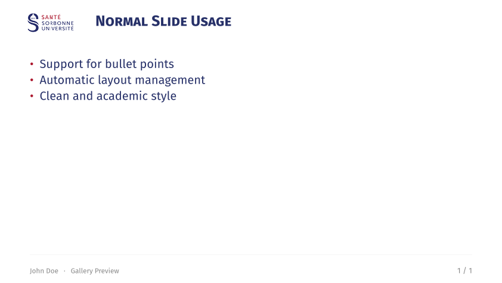
- `#focus-slide(body, subtitle: none)`: Highlight slide on solid theme background.
  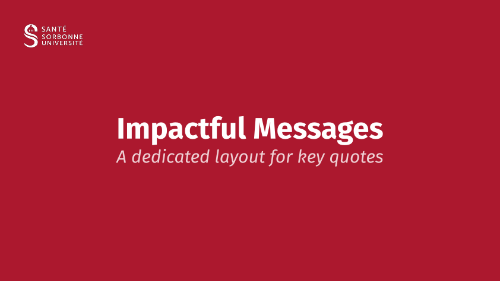
- `#figure-slide(fig, title: none, caption: none, ..)`: Centered figure slide.
  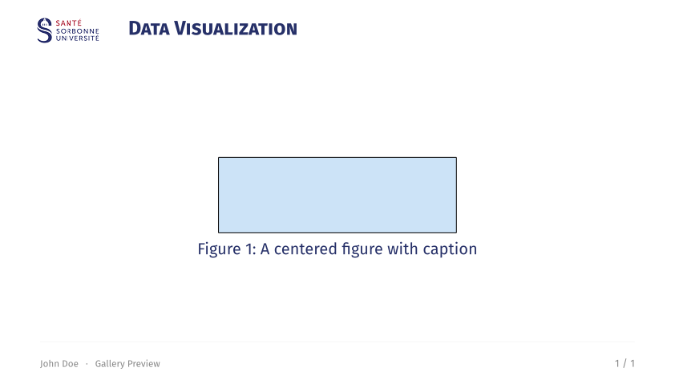
- `#equation-slide(equation, title: none, definitions: none, citation: none, ..)`: Large equation with "signature".
  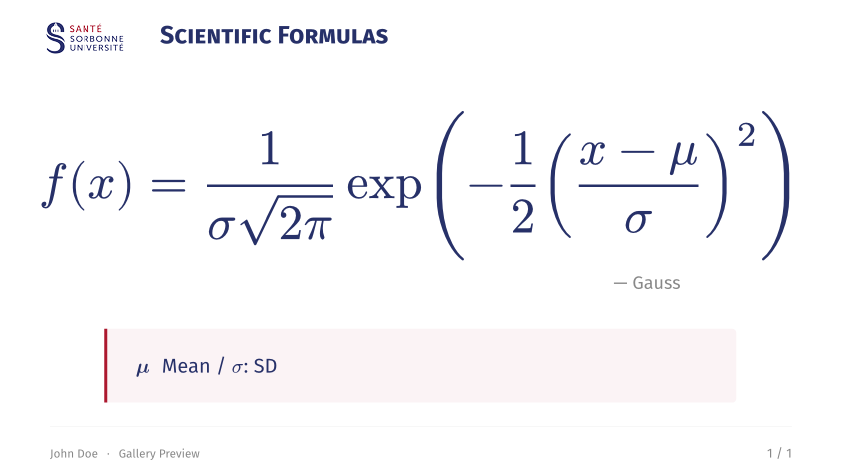
- `#acknowledgement-slide(people: (), institutions: (), ..)`: Thank-you slide.
  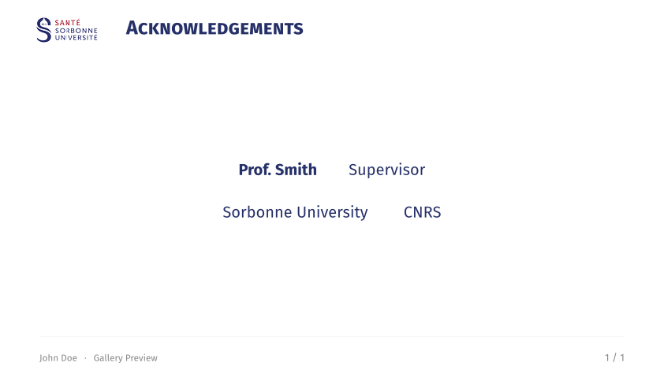
- `#ending-slide(title: none, subtitle: none, contact: ())`: Closing slide.
  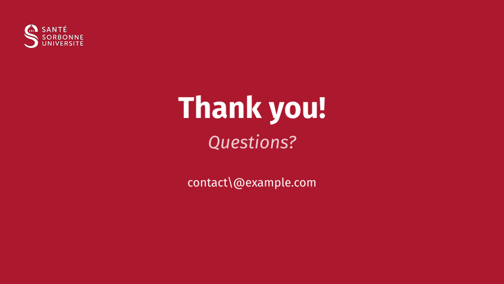

### Text Helpers
- `#alert[text]`: Highlighted bold text in primary color.
- `#muted[text]`: Gray secondary text.
- `#subtle[text]`: Light gray tertiary text.


### Citations
- Inline and corner citations.
  `#cite-box("smith2023", position: "bottom-right")`
  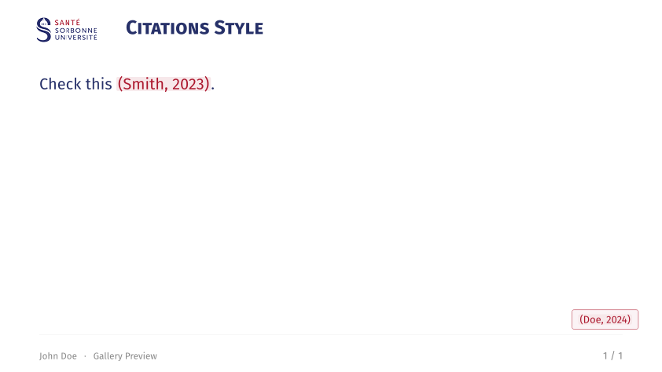

### Layout & Boxes
- `#two-col(left, right, columns: (1fr, 1fr))`: Balanced columns.
  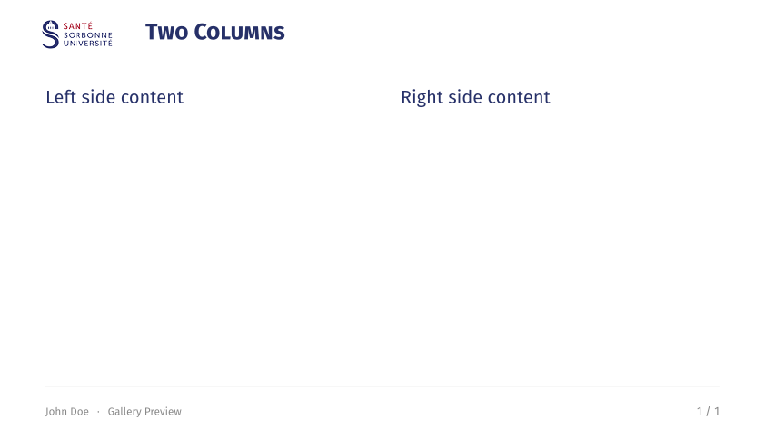
- `#three-col(left, center, right)`: Three column layout.
  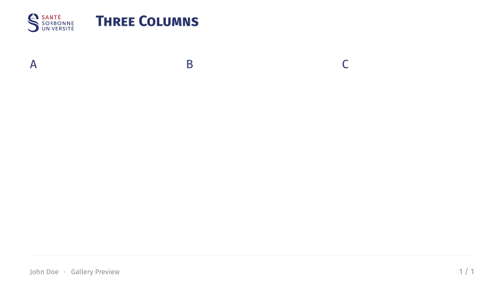
- `#grid-2x2(tl, tr, bl, br)`: Four-quadrant grid layout.
  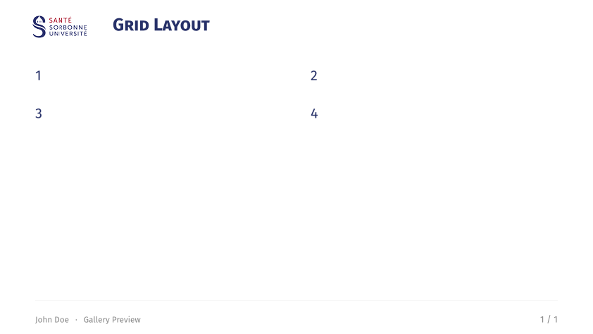
- **Boxes**: All boxes support the `fill-mode` parameter (`"outline"`, `"fill"`, `"full"`).
  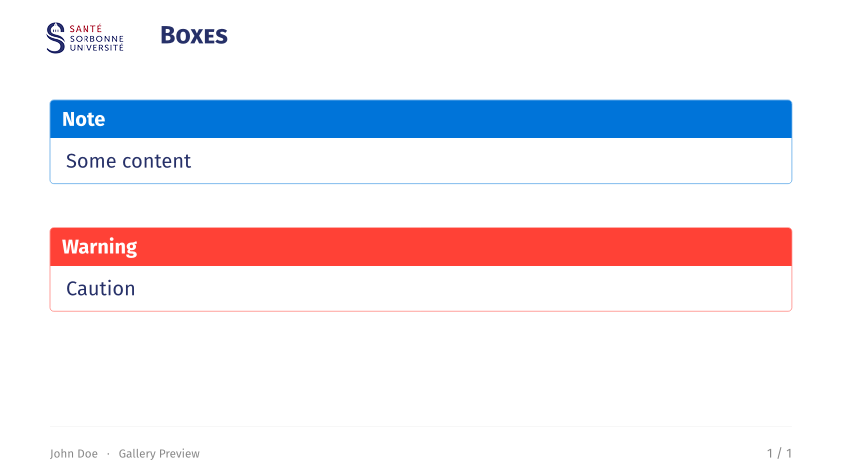
  - `#highlight-box(title, body)`: Blue university-styled box for key points.
  - `#alert-box(title, body)`: Red cautionary box for warnings.
  - `#example-box(title, body)`: Green academic box for examples.
  - `#algorithm-box(title, body)`: Monospace box for code/logic.
  - `#themed-block(title, body)`: Box automatically matching the theme color.

---

## Credits

- **Underlying Packages**: Built with [presentate](https://typst.app/universe/package/presentate) and [navigator](https://typst.app/universe/package/navigator).
- **Inspiration**: Layout features were inspired by the [calmly-touying](https://typst.app/universe/package/calmly-touying) theme.

## License

MIT License. See [LICENSE](LICENSE) for details.
